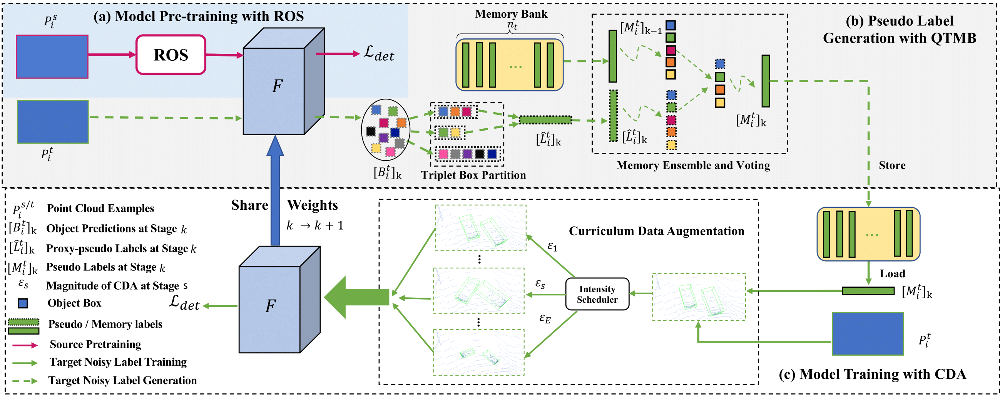

# ST3D

Code release for the paper **ST3D: Self-training for Unsupervised Domain Adaptation on 3D Object Detection**, CVPR 2021



**Authors**: Jihan Yang\*, Shaoshuai Shi\*,  Zhe Wang, Hongsheng Li, Xiaojuan Qi (\*equal contribution)

[[arXiv]](https://arxiv.org/abs/2103.05346)&nbsp;


## Overview

Our code will be coming soon.


## Introduction

Our code is based on [OpenPCDet v0.2](https://github.com/open-mmlab/OpenPCDet/tree/v0.2.0). More updates on [OpenPCDet](https://github.com/open-mmlab/OpenPCDet) are supposed to be compatible with our code.

### Supported features and ToDo List

- [ ] Support inference and pre-trained model 

- [ ] Support training code

## Model Zoo


## Installation


## License

Our code is released under the Apache 2.0 license.

## Acknowledgement

Our code is heavily based on [OpenPCDet v0.2](https://github.com/open-mmlab/OpenPCDet/tree/v0.2.0). Thanks OpenPCDet Development Team for their awesome codebase.

## Citation

If you find this project useful in your research, please consider cite:
```
@inproceedings{yang2021st3d,
    title={ST3D: Self-training for Unsupervised Domain Adaptation on 3D Object Detection},
    author={Yang, Jihan and Shi, Shaoshuai and Wang, Zhe and Li, Hongsheng and Qi, Xiaojuan},
    booktitle={Proceedings of the IEEE/CVF Conference on Computer Vision and Pattern Recognition},
    year={2021}
}
```
```
@misc{openpcdet2020,
    title={OpenPCDet: An Open-source Toolbox for 3D Object Detection from Point Clouds},
    author={OpenPCDet Development Team},
    howpublished = {\url{https://github.com/open-mmlab/OpenPCDet}},
    year={2020}
}
```
