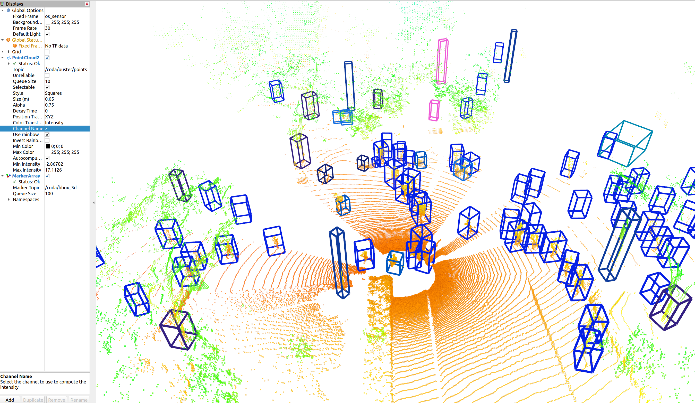

# Getting Started
The dataset configs are located within [tools/cfgs/dataset_configs](../tools/cfgs/dataset_configs), 
and the model configs are located within [tools/cfgs](../tools/cfgs) for different datasets. 

## Dataset Preparation

Currently, we support the CODa, JRDB, KITTI, nuScenes, and Waymo datasets. For JRDB support, you should use the jrdb branch in this repository.
We describe how to prepare the other datasets in the [preparing external datasets section](#external-datasets).

### Campus Object Dataset (CODa)

Please download the official CODa using the [dataset development kit](https://github.com/ut-amrl/coda-devkit) 
and link it in the data directory in this repo as follows. You may need to symlink the `3d_raw` directory
to the `3d_comp` directory if you downloaded CODa by split rather than by sequence.

```
coda-models
├── data
│   ├── coda_original_format
│       ├── 2d_rect
|       ├── 3d_raw
│       ├── calibrations
│       ├── metadata
│       ├── poses
|       ├── timestamps
├── pcdet
├── tools
```

* Convert from CODa file format to KITTI format
```python
python tools/create_data.py coda
```

* Generate the data infos by running the following command:
```python
python -m pcdet.datasets.coda.coda_dataset create_coda_infos tools/cfgs/dataset_configs/da_coda_oracle_dataset_full.yaml
```

You should now see the following file structure.

```
coda-models
├── data
│   ├── coda_original_format
│       ├── 2d_rect
|       ├── 3d_raw
│       ├── calibrations
│       ├── metadata
│       ├── poses
|       ├── timestamps
│   ├── coda128_allclass_full
│       ├── gt_database
|       ├── ImageSets
│       ├── testing
│       ├── training
│       ├── coda_dbinfos_train.pkl
|       ├── coda_infos_test.pkl
|       ├── coda_infos_train.pkl
|       ├── coda_infos_trainval.pkl
|       ├── coda_infos_val.pkl
├── pcdet
├── tools
```
## Downloading Pretrained Model Weights
The examples below use the provided pretrained model on 32 vertical channel resolution. You will need to **download the pretrained weights** from our **[data server](https://web.corral.tacc.utexas.edu/texasrobotics/web_CODa/pretrained_models/)**. We provide an example below showing how to download weights for the 32 channel LiDAR resolution to the default location that this repo uses for the demos.

```code
mkdir ckpts
cd ckpts
wget https://web.corral.tacc.utexas.edu/texasrobotics/web_CODa/pretrained_models/32channel/coda32_allclass_bestoracle.pth
```

## Live Visualization using ROS (ROS Installation Required)

You will need to have installed the ROS in your conda environment according to the [INSTALL.md](./INSTALL.md)
for the following to work. In a separate terminal, publish your point clouds over ROS. Run the following command,
replacing `YOUR_POINT_CLOUD_TOPIC_NAME` with the point cloud topic being published. Depending on your ROS
configuration, the maximum inference frequency varies between 2-5 Hz. You do not need to download CODa to try
this demo.

```
python ros_demo.py --pc YOUR_POINT_CLOUD_TOPIC_NAME --ckpt PATH_TO_YOUR_PRETRAINED_WEIGHTS_FILE
```

You should see something that looks like this:



## Visualize Detector Performance on CODa (Open3D)

Before visualizing object detections on CODa, you will first need to download the pre-trained model weights and preprocess CODa according to the dataset preparation section. Then, run the following command, specifying the path to the model weights.

```
python demo.py --ckpt PATH_TO_YOUR_PRETRAINED_WEIGHTS_FILE
```

## Visualize Detector Performance on Custom Dataset (Open3D)

To visualize the pre-trained model predictions on your dataset. Create a directory named `velodyne` and place the `.bin` files that you would like to use in this directory. Then set the `--data_path` cli argument to the parent directory for your `velodyne` directory. The file structure should look as follows:

```
PARENT_DIRECTORY
├── velodyne
│   ├── "000000.bin"
│   ├── ...
```

Then, run the set the `--ckpt` argument to your model weights path and run the command below to visualize the predictions on Open3D.  

```
python demo.py --ckpt ../output/da-coda-coda_models/waymocenterhead/pvrcnn_allclass128full_finetune_headfull/coda128bestwaymoLR0.010000OPTadam_onecycle/ckpt/checkpoint_epoch_30.pth --dataset_name demo --data_path {PARENT_DIRECTORY} --ext .bin
```

# Training 
You could optionally add extra command line parameters `--batch_size ${BATCH_SIZE}` and `--epochs ${EPOCHS}` to specify your preferred parameters. 
  

* Train with multiple GPUs or multiple machines
```shell script
sh scripts/dist_train.sh ${NUM_GPUS} --cfg_file ${CONFIG_FILE}

# or 

sh scripts/slurm_train.sh ${PARTITION} ${JOB_NAME} ${NUM_GPUS} --cfg_file ${CONFIG_FILE}
```

### Train the Pre-trained 
Take Source Only model with SECOND-IoU on Waymo -> KITTI  as an example:
```shell script
sh scripts/dist_train.sh ${NUM_GPUS} --cfg_file cfgs/da-waymo-kitti_models/secondiou/secondiou_old_anchor.yaml \
    --batch_size ${BATCH_SIZE}
```
Notice that you need to select the **best model** as your Pre-train model, 
because the performance of adapted model is really unstable when target domain is KITTI.

### Self-training Process
You need to set the `--pretrained_model ${PRETRAINED_MODEL}` when finish the
following self-training process.
```shell script
sh scripts/dist_train.sh ${NUM_GPUS} --cfg_file cfgs/da-waymo-kitti_models/secondiou_st3d/secondiou_st3d_car.yaml \
    --batch_size ${BATCH_SIZE} --pretrained_model ${PRETRAINED_MODEL}
```
Notice that you also need to focus the performance of the **best model**.

# Testing

* Test with a pretrained model: 
```shell script
python test.py --cfg_file ${CONFIG_FILE} --batch_size ${BATCH_SIZE} --ckpt ${CKPT}
```

* To test all the saved checkpoints of a specific training setting and draw the performance curve on the Tensorboard, add the `--eval_all` argument: 
```shell script
python test.py --cfg_file ${CONFIG_FILE} --batch_size ${BATCH_SIZE} --eval_all
```

* Notice that if you want to test on the setting with KITTI as **target domain**, 
  please add `--set DATA_CONFIG_TAR.FOV_POINTS_ONLY True` to enable front view
  point cloud only: 
```shell script
python test.py --cfg_file ${CONFIG_FILE} --batch_size ${BATCH_SIZE} --eval_all --set DATA_CONFIG_TAR.FOV_POINTS_ONLY True
```

* To test with multiple GPUs:
```shell script
sh scripts/dist_test.sh ${NUM_GPUS} \
    --cfg_file ${CONFIG_FILE} --batch_size ${BATCH_SIZE}

# or

sh scripts/slurm_test_mgpu.sh ${PARTITION} ${NUM_GPUS} \ 
    --cfg_file ${CONFIG_FILE} --batch_size ${BATCH_SIZE}
```


# Preparing Other Datasets
<a name="external-datasets"></a>

### KITTI Dataset
* Please download the official [KITTI 3D object detection](http://www.cvlibs.net/datasets/kitti/eval_object.php?obj_benchmark=3d) dataset and organize the downloaded files as follows (the road planes could be downloaded from [[road plane]](https://drive.google.com/file/d/1d5mq0RXRnvHPVeKx6Q612z0YRO1t2wAp/view?usp=sharing), which are optional for data augmentation in the training):
* NOTE: if you already have the data infos from `pcdet v0.1`, you can choose to use the old infos and set the DATABASE_WITH_FAKELIDAR option in tools/cfgs/dataset_configs/kitti_dataset.yaml as True. The second choice is that you can create the infos and gt database again and leave the config unchanged.

```
OpenPCDet
├── data
│   ├── kitti
│   │   │── ImageSets
│   │   │── training
│   │   │   ├──calib & velodyne & label_2 & image_2 & (optional: planes)
│   │   │── testing
│   │   │   ├──calib & velodyne & image_2
├── pcdet
├── tools
```

* Generate the data infos by running the following command: 
```python 
python -m pcdet.datasets.kitti.kitti_dataset create_kitti_infos tools/cfgs/dataset_configs/kitti_dataset.yaml
```

### NuScenes Dataset
* Please download the official [NuScenes 3D object detection dataset](https://www.nuscenes.org/download) and 
organize the downloaded files as follows: 
```
OpenPCDet
├── data
│   ├── nuscenes
│   │   │── v1.0-trainval (or v1.0-mini if you use mini)
│   │   │   │── samples
│   │   │   │── sweeps
│   │   │   │── maps
│   │   │   │── v1.0-trainval  
├── pcdet
├── tools
```

* Install the `nuscenes-devkit` with version `1.0.5` by running the following command: 
```shell script
pip install nuscenes-devkit==1.0.5
```

* Generate the data infos by running the following command (it may take several hours): 
```python 
python -m pcdet.datasets.nuscenes.nuscenes_dataset --func create_nuscenes_infos \ 
    --cfg_file tools/cfgs/dataset_configs/nuscenes_dataset.yaml \
    --version v1.0-trainval
```

### Waymo Open Dataset
* Please download the official [Waymo Open Dataset](https://waymo.com/open/download/), 
including the training data `training_0000.tar~training_0031.tar` and the validation 
data `validation_0000.tar~validation_0007.tar`.
* Unzip all the above `xxxx.tar` files to the directory of `data/waymo/raw_data` as follows (You could get 798 *train* tfrecord and 202 *val* tfrecord ):  
```
OpenPCDet
├── data
│   ├── waymo
│   │   │── ImageSets
│   │   │── raw_data
│   │   │   │── segment-xxxxxxxx.tfrecord
|   |   |   |── ...
|   |   |── waymo_processed_data
│   │   │   │── segment-xxxxxxxx/
|   |   |   |── ...
│   │   │── pcdet_gt_database_train_sampled_xx/
│   │   │── pcdet_waymo_dbinfos_train_sampled_xx.pkl   
├── pcdet
├── tools
```
* Install the official `waymo-open-dataset` by running the following command: 
```shell script
pip3 install --upgrade pip
# tf 2.0.0
pip3 install waymo-open-dataset-tf-2-0-0==1.2.0 --user
```

* Extract point cloud data from tfrecord and generate data infos by running the following command (it takes several hours, 
and you could refer to `data/waymo/waymo_processed_data` to see how many records that have been processed): 
```python 
python -m pcdet.datasets.waymo.waymo_dataset --func create_waymo_infos \
    --cfg_file tools/cfgs/dataset_configs/waymo_dataset.yaml
```

Note that you do not need to install `waymo-open-dataset` if you have already processed the data before and do not need to evaluate with official Waymo Metrics. 

# Using Pretrained Models

## Visualize Detector Performance on CODa

Before visualizing object detections on CODa, you will first need to download the pre-trained model weights. Then, run the following command, specifying the path to the model weights.

```
python demo.py --ckpt ../output/da-coda-coda_models/waymocenterhead/pvrcnn_allclass128full_finetune_headfull/coda128bestwaymoLR0.010000OPTadam_onecycle/ckpt/checkpoint_epoch_30.pth
```

## Visualize Detector Performance on Custom Dataset

To visualize the pre-trained model predictions on your dataset. Create a directory named `velodyne` and place the `.bin` files that you would like to use in this directory. Then set the `--data_path` cli argument to the parent directory for your `velodyne` directory. The file structure should look as follows:

```
PARENT_DIRECTORY
├── velodyne
│   ├── "000000.bin"
│   ├── ...
```

Then, run the set the `--ckpt` argument to your model weights path and run the command below to visualize the predictions on Open3D.  

```
python demo.py --ckpt ../output/da-coda-coda_models/waymocenterhead/pvrcnn_allclass128full_finetune_headfull/coda128bestwaymoLR0.010000OPTadam_onecycle/ckpt/checkpoint_epoch_30.pth --dataset_name demo --data_path {PARENT_DIRECTORY} --ext .bin
```

## Training & Testing


### Test and evaluate the pretrained models
* Test with a pretrained model: 
```shell script
python test.py --cfg_file ${CONFIG_FILE} --batch_size ${BATCH_SIZE} --ckpt ${CKPT}
```

* To test all the saved checkpoints of a specific training setting and draw the performance curve on the Tensorboard, add the `--eval_all` argument: 
```shell script
python test.py --cfg_file ${CONFIG_FILE} --batch_size ${BATCH_SIZE} --eval_all
```

* Notice that if you want to test on the setting with KITTI as **target domain**, 
  please add `--set DATA_CONFIG_TAR.FOV_POINTS_ONLY True` to enable front view
  point cloud only: 
```shell script
python test.py --cfg_file ${CONFIG_FILE} --batch_size ${BATCH_SIZE} --eval_all --set DATA_CONFIG_TAR.FOV_POINTS_ONLY True
```

* To test with multiple GPUs:
```shell script
sh scripts/dist_test.sh ${NUM_GPUS} \
    --cfg_file ${CONFIG_FILE} --batch_size ${BATCH_SIZE}

# or

sh scripts/slurm_test_mgpu.sh ${PARTITION} ${NUM_GPUS} \ 
    --cfg_file ${CONFIG_FILE} --batch_size ${BATCH_SIZE}
```


### Train a model
You could optionally add extra command line parameters `--batch_size ${BATCH_SIZE}` and `--epochs ${EPOCHS}` to specify your preferred parameters. 
  


# Reproducing Oracle Benchmarks

We provide all of the model configurations with short descriptions for each of the models trained for the CODa
paper in the scripts directory. We list the experiments that use each of the slurn job files.

## ls6_slurn_train.bash
1. AV Datasets to CODa (Train from scratch, ST3D++ self-training, Finetuning)
2. AV Dataset Benchmarks
3. CODa to AV Datasets
4. CODa pretrained models for 3 classes

## ls6_slurn_jrdbtrain.bash 
1. CODa/Waymo to JRDB
2. JRDB to JRDB

### Self-training Process
You need to set the `--pretrained_model ${PRETRAINED_MODEL}` when finish the
following self-training process.
```shell script
sh scripts/dist_train.sh ${NUM_GPUS} --cfg_file cfgs/da-waymo-kitti_models/secondiou_st3d/secondiou_st3d_car.yaml \
    --batch_size ${BATCH_SIZE} --pretrained_model ${PRETRAINED_MODEL}
```
Notice that you also need to focus the performance of the **best model**.

# Reproducing Oracle Benchmarks

## UT CODa - PP 
`cfgs/coda_models/pointpillar_1x.yaml`

## UT CODa - CP
`cfgs/code_models/centerpoint.yaml`

## UT CODa - PVRCNN
`cfgs/coda_models/pvrcnn_oracle.yaml`

## nuScenes - PP
`cfgs/da-nuscenes-coda_models/cbgs_pp_multihead.yaml`

## nuScenes - CP
`cfgs/da-nuscenes-coda_models/da_cbgs_voxel0075_res3d_centerpoint.yaml`

## nuScenes - PVRCNN
tbd

## Waymo - PP
`cfgs/da-waymo-coda_models/da_pointpillar_1x.yaml`
## Waymo - CP
`cfgs/da-waymo-coda_models/da_centerpoint.yaml`
## Waymo - PVRCNN
`cfgs/da-waymo-coda_models/pvrcnn/da_pvrcnn_with_centerhead_rpn.yaml`

# Reproducing Domain Adaptation Results

## Waymo - Direct

Train waymo using coda pvrcnn architecture

`cfgs/da-waymo-coda_models/direct_coda_pvrcnn_oracle.yaml`

Run with ./dist_test.sh to eval on coda

`cfgs/da-waymo-coda_models/direct_coda_pvrcnn_oracle.yaml`

## Waymo - ST

Use Waymo direct as pretrained model

`cfgs/da-waymo-coda_models/pvrcnn_st3d/pvrcnn_st3d.yaml`

## Waymo - FT

Use Waymo direct as pretrained model

`cfgs/da-waymo-coda_models/pvrcnn_st3d/pvrcnn_st3d_finetune_head.yaml`
`cfgs/da-waymo-coda_models/pvrcnn_st3d/pvrcnn_st3d_finetune_headfull.yaml`

## Waymo - ST FT

Use Waymo ST as pretrained model

`cfgs/da-waymo-coda_models/pvrcnn_st3d/pvrcnn_st3d_finetune_headfull.yaml`

## nuScenes - Direct
TBD

# Reproducing UT CODa to AV Datasets

## UT CODa32 FT nuScenes 

Dist Train (train on UT CODa eval on nuScenes) Choose best epoch to finetune later

`cfgs/da-coda-nuscenes_models/pvrcnn_32oracle_coda.yaml`

Dist Train (finetune head)

`cfgs/da-coda-nuscenes_models/pvrcnn_32oracle_finetune_head.yaml`

Dist Train (finetune full)

`cfgs/da-coda-nuscenes_models/pvrcnn_32oracle_finetune_headfull.yaml`

## UT CODa128 FT nuScenes 

Dist Train (Train on UT Coda eval on nuScenes) Choose best epoch to finetune later

`cfgs/da-coda-nuscenes_models/pvrcnn_128oracle_coda.yaml`

Dist Train (finetune head)

`cfgs/da-coda-nuscenes_models/pvrcnn_128oracle_finetune_head.yaml`

Dist Train (finetune full)

`cfgs/da-coda-nuscenes_models/pvrcnn_128oracle_finetune_headfull.yaml`

## UT CODa32 FT Waymo 

Dist Train (Train on UT Coda eval on Waymo) Choose best epoch to finetune later

`cfgs/da-coda-waymo_models/pvrcnn_32oracle_coda.yaml`

Dist Train (finetune head)

`cfgs/da-coda-waymo_models/pvrcnn_32oracle_finetune_head.yaml`

Dist Train (finetune full)

`cfgs/da-coda-waymo_models/pvrcnn_32oracle_finetune_heafull.yaml`

## UT CODa128 FT Waymo 

Dist Train (Train on UT Coda eval on Waymo) Choose best epoch to finetune later

`cfgs/da-coda-waymo_models/pvrcnn_128oracle_coda.yaml`

Dist Train (finetune head)

`cfgs/da-coda-waymo_models/pvrcnn_128oracle_finetune_head.yaml`

Dist Train (finetune full)

`cfgs/da-coda-waymo_models/pvrcnn_128oracle_finetune_headfull.yaml`

